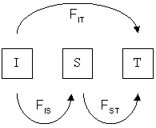

```{r setup, include = FALSE}
options(width = 160, digits = 4) # to prevent premature text wrapping and reduce number of displayed digits
knitr::opts_chunk$set(cache = FALSE, cache.path = "knitr/cache/", fig.path = "knitr/figures/")
```

------------------------------------------------------------------------

# Before we really start

------------------------------------------------------------------------

## Why using `R` for genetics/genomics?

-   you will need to learn `R` anyhow to analyse non-genetic data
-   you may want to integrate your analysis into a larger workflow (e.g. statistical analysis, plots)
-   you may not want to learn how to use 50 different pieces of software with various syntax

------------------------------------------------------------------------

## Objectives

-   gain familiarity with `R`
-   understand how microsatellite data can be handled in `R`
-   perform basic genetic analyses using the packages `adegenet`, `pegas`, `poppr`, and `hierfstat`
-   use Rmarkdown to produce a report of the analyses, incorporating the workflow and results

------------------------------------------------------------------------

## Our case study: reintroduced populations of the Eurasian lynx

Here's a pretty pic, so we know what we're working on.


------------------------------------------------------------------------

This large felid used to occur throughout Europe, but was virtually extinct in central and western Europe by the 19th century.

In an effort to re-establish the species, lynx were re-introduced in some EU countries in the last decades.

You can see their distribution here on the IUCN web page: <https://www.iucnredlist.org/species/12519/121707666>


------------------------------------------------------------------------

## Overview of the lynx data

We will have microsatellite data from 9 populations. Some of these are reintroduced populations, some are natural (or "*autochthonous*") populations. 

------------------------------------------------------------------------

Re-introductions frequently involve only a small number of animals. Especially, if they are dangerous!

Having a small *founding population* can impact genetic diversity:

1. you are only introducing variation present in a few individuals

2. not all introduced animals will mate (so variation will be lost)

3. population size impacts the maintenance of variation. Small populations often lose variation over time due to genetic drift.

One of the things we will do is look at measures of diversity in the lynx populations. In particular, we will assess if we can notice a difference between autochthonous and reintroduced populations.

------------------------------------------------------------------------

**Note:** not all of the re-introductions were documented, but we can use genetics to try to figure out where re-introduced lynx originated.

------------------------------------------------------------------------

## Basic workflow today

1. Importing the data into `R`

2. Quality control of the data

3. Descriptive statistics of our populations

4. Population comparisons


------------------------------------------------------------------------

## About this document

This document is an Rmarkdown document.
An Rmarkdown document is the combination of a Markdown document with chunks of `R` code in the middle that are evaluated using an `R` package called `knitr`.

Rmarkdown document can be used interactively, or they can be turned into beautiful HTML document or other (e.g. PDF, Word, ...) if you click on the button "Knit" on top.

The benefits of using an Rmarkdown document is that you have your text, scripts, results, plots and tables in a single place.

You can edit the current Rmarkdown file to add your own notes to it and to try out or even modify the `R` code. Before you do that, do save your Rmarkdown file under a different name, so that you can go back to the original version if you need to.

If you want to extract all the R code from the Rmarkdown document, to focus on code only, just do:

```{r purl, eval = FALSE}
# file.remove("R4G_course.R") # uncomment and run to remove existing file
knitr::purl("R4G_course.Rmd")
```

**Note:** it will create a file called `R4G_course.R` but it won't overwrite it if it already exists.
So, if you want some changes to be taken into account, make sure you delete the `R` file beforehand.

### Basic Markdown syntax

Just write plain text in the script. You can use different number of stars to indicate:

-   `*italic*` -\> *italic*
-   `**bold**` -\> **bold**
-   `***both***` -\> ***both***

### Basic `knitr` syntax

Use ```` ```{r} ```` to start an `R` chunk and ```` ``` ```` to close it.

For example if you type `1 + 1` within a chunk, it will be displayed as:

```{r one plus one}
1 + 1
```
Then, to evaluate the chunk, just press CTRL-R after having put your mouse cursor inside the chunk (anywhere).

You can learn more about Rmarkdown on [this online book](https://bookdown.org/yihui/rmarkdown/), or if you already know a little, the [RStudio cheatsheet](https://raw.githubusercontent.com/rstudio/cheatsheets/main/rmarkdown.pdf) will help you to refresh your memory.

------------------------------------------------------------------------

## Getting all the `R` packages ready

We will use the `R` packages `adegenet`, `pegas`, `poppr`, and `hierfstat` for the analyses and `ggplot2`, `lattice` and `viridisLite` for the plots. If you have already installed before, you can simply load the packages as follow:

```{r loading packages, message = FALSE}
library(adegenet)
library(pegas)
library(poppr)
library(hierfstat)
library(ggplot2)
library(lattice)
library(viridisLite)
```

**Note 1:** If one of the package is missing, then you must install it BEFORE loading them. For example, to install `adegenet` do:

```{r installing packages, eval = FALSE}
install.packages("adegenet")
```

**Note 2:** To be able to "knit" the Rmarkdown, you will also need other `R` packages, but just try knitting and RStudio should guide you through the necessary steps.

We also add a few extra functions we coded for you:

```{r sourcing}
source("scripts/tools.R")
```

------------------------------------------------------------------------

# Importing the data into `R`

------------------------------------------------------------------------

## The `genepop` format

We will be using a very common type of input file for microsatellite data, which was originally developed for a stand-alone program called **Genepop**.
You will learn how to create a genepop file with Jörns tomorrow. Today we will use one that we have made for you.

Here is the basic structure:

    comment line
              locus-1, locus-2, locus-3, ... 
    pop
    Ind-1  ,   100102   135135   204208  ...
    Ind-2  ,   100100   131139   200208  ...
    Ind-3  ,   102102   131139   200204  ...
    Ind-4  ,   000000   135139   208208  ...
    ...

1.  the first line is a "comment line" - you can keep notes on your project here. E.g. "24 animals, 8 loci"

2.  the second line contains the names of the loci (locus-1, ...).

3.  the third line has a "pop flag" that indicates the next samples belong to the same population.

4.  below this (until the next *pop flag*), every line is a multi-locus genotype per individual belonging to the population:

    -   the first column with sample ID (followed by a comma)
    -   the following columns with the genotype at a given locus (the two alleles, without a separator)
    -   missing data at a locus is denoted by "000000"

***Is everyone comfortable with the terms locus, allele and genotype?***

------------------------------------------------------------------------

### Reading your data into `R`

In the folder `data` in this RStudio project you can find the genepop file called `lynx.gen`.

We can create an `R` object that contains the data in `lynx.gen` using the `read.genepop()` function of `adegenet`.
Here we need to provide the path of the file as `"/data/lynx.gen"` using `file =`, and some information about how microsatellite data is encoded in the file using `ncode =`.
(And here we also set the argument `quiet = TRUE`; this is just to shorten this document by not displaying some messages, so you don't have to do that.)

```{r read genepop files, eval = TRUE}
myData <- read.genepop(file = "data/lynx_new.gen", ncode = 3, quiet = TRUE)
```

***Why did we use `ncode = 3`?***

Now the data is read into `R`.

If there had been a problem with the data file (e.g. incorrectly formatted), then we would have got an error message. Let's try:

```{r formating error while reading, error=TRUE, eval=FALSE}
badFormat <- read.genepop(file = "data/badFormatting.gen", ncode = 3, quiet = TRUE)
```

We "broke" the input file by including fewer locus names than data.
The error message is telling us that the length of `dimnames [1]` (= number of locus names) does not correspond to the number of columns containing the data.

As you can see, `R` provides us with a clue about what the problem is.

**Geeky note:** if you want to be able to use the RStudio feature "Run All Chunks Above", you should switch the previous and next chunk options to `eval=FALSE`, otherwise the error generated will break prevent all chunks below to run.

Another way we can generate an error is by providing wrong arguments to the function, despite having a properly formatted file:

```{r input error while reading, error=TRUE, eval=FALSE}
badInput <- read.genepop(file = "data/lynx_new.gen", ncode = 2, quiet = TRUE)
```

Unsurprisingly, there will be an error if you type the path to the file incorrectly.

One way to limit such issues is to list all genepop files in the folder containing the data (to make sure that the file is where you are trying to read it):

```{r listing files}
dir(path = "data/", pattern = ".gen")
```

------------------------------------------------------------------------

# `R` representations of your data

## The `genind` format

We haven't looked at our in data yet, so let's do it!

```{r first look at a genind object}
myData
```

------------------------------------------------------------------------

**Geeky note:** for more details on the content of the `genind` object, just use `str()`:

```{r behind the genind object 1}
str(myData)
```

or for even more geeky details:

```{r behind the genind object 2, eval = FALSE}
print.AsIs(myData)
```

The output of the previous chunk is not displayed here because it is particularly long.

**Geeky note:** as you can see, the `genind` object is a special list. Technically it is a so-called S4 object. Instead of accessing elements with `$` (the typical way to access elements in S3 objects -- the usual ones), when using S4 objects elements (called slots) are typically accessible with `@`, which is why `@` showed up above. Yet, to make things easier, the programmer behind `adegenet` made it possible to use `$` anyway.

Since manipulating such objects is a little complicated, instead of exploiting the internal structure of the objects you should use (when it is possible) the *accessors* embedded in the packages:

```{r accessor_nInd}
nInd(myData) # Number of individuals
```

```{r accessor_nLoc}
nLoc(myData) # Number of loci
```

```{r accessor_nPop}
nPop(myData) # Number of populations
```

```{r accessor_locNames}
locNames(myData) # Names of loci
```

```{r accessor_alleles}
alleles(myData) # List of all alleles
```

```{r accessor_nAll}
nAll(myData, onlyObserved  = TRUE) # Number of alleles for each locus
```

```{r accessor_indNames}
indNames(myData) # Names of individuals
```

```{r accessor_popNames}
popNames(myData) # Name of the last individual in each population
```

Some of the accessors can also be used to redefine some information (to handle with great care!):

```{r accessors for replacement}
#let's give the pops some names, based on their population of origin:

myPops <- c("Estonia", "Latvia", "Poland", "Russia", "Slovenia", "Croatia", "Bavaria", "France", "Slovakia")
popNames(myData) <- myPops
popNames(myData)
```

```{r accessors for replacement 2}
pop(myData)
```

------------------------------------------------------------------------

## The `data.frame` format

Not all `R` packages dealing with genetics/genomics use `genind` objects (it would be convenient if they did!).
The package `hierfstat`, for example, just uses a plain `data.frame` where the first column contains the population to which the different individuals belong, and the following columns contain the genotype of the individuals (one locus per column).

In general there are functions to convert one format into another.
To convert a `genind` object into a `data.frame` you can use `genind2hierfstat()` from the package `hierfstat`:

```{r genind to df}
myData_hierf <- genind2hierfstat(myData)
head(myData_hierf) # Display first 6 rows
```


------------------------------------------------------------------------

## The `loci` format

The package `pegas`, which allows for the computation of many useful metrics, relies on an alternative format called `loci`.
Again, it is easy to convert a `genind` object into a `loci` object:

```{r genind to loci, }
myData_loci <- genind2loci(myData) # or as.loci(myData)
print(myData_loci, details = FALSE) # same as just myData_loci in the console
```

The default `loci` output is more simple than that of the `genind` format (at least in the `R` console, but not necessarily in Rmarkdown documents) but you can try `print(myData_loci, details = TRUE)` for getting a `data.frame` as an output.

------------------------------------------------------------------------

**Geeky note:** a `loci` object is a `data.frame` (an S3 object) with an additional *attribute* called `"locicol"`:

```{r exploring loci objects 1}
str(myData_loci)
```

```{r exploring loci objects 2}
head(data.frame(myData_loci), n = 10) # first 10 rows
```

```{r exploring loci objects 3}
attr(myData_loci, "locicol") # columns that contain loci
```

------------------------------------------------------------------------

# Checking your data

Let's check some basic things about the data in `myData`.

------------------------------------------------------------------------

## Missing data

An important consideration for analysis is the amount of missing data in our dataset.
Several types of analyses don't cope well with missing data.
In some cases this may lead to poor estimates, in other cases it may lead to samples or loci not being considered in the analyses.

We can use `info_table()` from `poppr` to find out about missing data, and also generate a convenient plot by including `plot = TRUE`.

```{r info table}
missing <- info_table(myData, df = TRUE) # df = TRUE uses a long rather than 
                                         # wide format for the df
missing[order(missing$Missing, decreasing = TRUE), ] # we reorder the table to show the highest missing on top
```

```{r info table plot}
info_table(myData, plot = TRUE, low = "white") ## NB: run in the console for best display
```

------------------------------------------------------------------------

**Geeky note 1:** it is tricky but you can modify anything in this plot even when `info_table()` as no option for it:

<!-- no evaluation as only work in interactive mode -->

```{r ggplot, eval = FALSE}
theplot <- ggplot_build(last_plot())
theplot$data[[4]]$size <- 3
theplot$data[[4]]$angle <- 45
plot(ggplot_gtable(theplot))
```

**Geeky note 2:** this does update the plot, but only in your console. So, if you try to export the plot using e.g. `ggsave("my_plot.pdf")` the changes won't be seen in the created file. For this to work, you would need to install the package `ggplotify` and then run `ggplotify::as.ggplot(ggplot_gtable(theplot))` instead of `plot(ggplot_gtable(theplot))` before calling `ggsave("my_plot.pdf")` or alike.

------------------------------------------------------------------------

We can see that there is missing data at multiple loci, spread across multiple populations. 

As a general rule of thumb, we try to keep missing data below 5% in order to minimize the impact on analyses.

***How do you think we can achieve this?***

We can check how many loci we need in order to distinguish all our samples based on their genotypes using `genotype_curve()`.

This function from the package `poppr` randomly samples from 1 to $n-1$ loci 100 times (without replacement) and counts the number of unique genotypes observed (MLG = MultiLocus Genotypes):

```{r genotype curve}
gencurv <- genotype_curve(myData)
```

***How many loci do we need in order to discriminate our genotypes?***

***Why is it run to $n-1$, and not to $n$?***

**Geeky note:** you can get the exact numbers of distinct genotypes given each number of loci considered:

```{r genotype curve in details}
apply(gencurv, 2, range)
```

As most missing data is concentrated in a single locus, rather than being thinly spread throughout the data set, we can remove the worst offender: *locus FCA441*.

We can 'drop' a locus from the `genind` object using the following code, if we know the number of the locus in the list of loci.

```{r remove pop by index, eval = FALSE, message = FALSE}
myData[loc = -c(2), drop = TRUE] # drop = TRUE updates the number of remaining alleles!
```

Most often it is preferable (*safer*) to remove loci using their names.
For this we need a bit more code:

```{r remove locus}
removeLoc <- c("FCA441")
myData <- myData[loc = !locNames(myData) %in% removeLoc, drop = TRUE]
```

Now let's check the new version of `myData`:

```{r new info data}
myData
```

Let's also rerun `info_table()` to see what's changed:

```{r new info table}
info_table(myData, plot = TRUE, low = "white")
```

We have significantly reduced the amount of missing data in `myData` 🎉.

***How else could we have solved this?***

How about our ability to discriminate genotypes?

```{r new genotype curve}
genotype_curve(myData)
```

***How does that compare to the previous genotype accumulation curve?***

***How does the maximum value for MLG compare to the number of individuals?***

------------------------------------------------------------------------

## MLG (MultiLocus Genotypes) vs individuals

Depending on how we obtain our genetic samples, we may not know if we have genotyped the same individual more than once.

For example, if we have been genotyping samples collected in a non-invasive way (e.g. hair or faeces), then we don't really have a way of knowing if we have obtained more than one sample per individual.

We know how many loci we need to distinguish individuals by using `genotype_curve()` above, so now we can check if we have genotyped any individual more than once. 

There is an `R` package called `alleleMatch` that can investigate this in detail.
However, it is not actively maintained.
Thankfully, `poppr` has some basic functionality to examine this.
Using `mlg()` we can check for the number of unique multilocus genotypes in `myData`.

**Geeky note:** all software that deals with genetic data has a way of labelling missing data. 
For example, many R packages use `NA`. 
As missing data can contribute to observed differences between genotypes, but such differences only reflect absence of data and not necessarily a biological difference, the `mlg()` function is coded in a way to ignore differences between genotypes resulting from missing data.

```{r mlg}
mlg(myData)
```

We have 153 samples, but only 149 unique multilocus genotypes. This suggests that 4 samples correspond to replicates from the same individual(s).
(We introduced that in the data on purpose to show you how to deal with such issues.)

**Note:** the `mlg()` function did not tell us *which* samples are the same.
For this we can use `mlg.id()`, but this gives us a very long list because it also includes the genotypes that occur only once.
Let us check the beginning of the output from `mlg.id()` using `head()`:

```{r mlg.id}
head(mlg.id(myData))
```

What we want to know is *which are the genotypes that occur more than once?*

We achieve this by looking for entries in the list with a length greater than one.

```{r identifying mlg}
myMLG <- mlg.id(myData)
myMLG[lengths(myMLG) > 1]
```

As we do not want to include sample replicates in our data, we should now remove one occurrence of each replicated genotype.
We will remove `P035`,`LCro16`,`P013`, and `2R11`.
We can follow the same principle we used to remove the locus earlier:

```{r dropping mlg}
removeInd <- c("P035","LCro16","P013","2R11")
myData <- myData[!indNames(myData) %in% removeInd, drop = TRUE]
myData
```

Now we have 149 unique genotypes in `myData`.

***If this were data from non-invasively collected samples, we may expect there to be more replicates that we have not yet detected. Why is that?***

------------------------------------------------------------------------

**Geeky note:** if you have to remove a lot of samples, you can do it easily by replacing the previous call by:

```{r dropping many loci, eval = FALSE}
samplesToKeep <- unlist(lapply(myMLG, function(x) x[1])) # Capture first occurence for each MLG
myData <- myData[indNames(myData) %in% samplesToKeep, drop = TRUE]
```


------------------------------------------------------------------------

## Are loci informative?

Another important consideration is to check if our loci are informative; otherwise, it would be useless to keep them.

The simplest example for an uninformative locus would be one for which all individuals would have the same genotype.

There is a common way to examine if a locus is informative. For this, we examine the so-called ***minor allele frequency*** (MAF): the frequency of the *second most common allele* at a locus. If this is higher than a threshold (often 1% = frequency of 0.01), a locus is considered informative. 

The function `informloci()` from `poppr` can be used to detect uninformative loci and remove them:

```{r informloci}
informloci(myData)
```

The important information we just obtained is the display *"All sites polymorphic"*.
That implies that, in our case, all loci are informative and they are kept.
Had we detected uninformative loci and wanted to remove them, we would have run the following to update the `myData` object after filtering out non-informative loci:

```{r informloci 2, eval = FALSE}
myData <- informloci(myData)
```

------------------------------------------------------------------------

# Genetic variation

------------------------------------------------------------------------

## A very simple exploration

You can easily explore genetic differences between individuals -- within each population -- using our home made little function which compares alleles between pairs of individuals:

```{r pairwise_similarity}
pairwise_similarity(myData, pop = "Estonia")
```

We can represent the results visually with a little more of `R` coding:

```{r pairwise_similarity2, results = "hide"}
lapply(popNames(myData), function(pop) hist(pairwise_similarity(myData, pop = pop, as_vector = TRUE), main = pop, xlim = c(0, 1))) # don't forget as_vector = TRUE
```

***Considering these plots of genetic similarity, which populations do you think are autochthonous, and which reintroduced?***

------------------------------------------------------------------------

***How would you do the same thing across all populations?***

```{r}
hist(pairwise_similarity(myData, as_vector = TRUE), xlim = c(0, 1)) # don't forget as_vector = TRUE
```

------------------------------------------------------------------------

## Allele vs genotype frequencies

Consider the following two populations with different genotype frequencies:

>                  AA    Aa    aa
>           Pop1   50     0    50
>           Pop2   25    50    25

***Do the genotype frequencies of the two populations differ?***

***Do the allele frequencies of the two populations differ?***

------------------------------------------------------------------------

## The Hardy-Weinberg equilibrium (HWE)

### Assumptions

1.  Genotype frequencies are the same in males and females.

2.  Individuals mate at random *with respect to their genotype at this particular locus* (**panmixia**).

3.  Meiosis is fair.

4.  There is no new genetic material (**no mutation**).

5.  There is no gene flow (**no migration**).

6.  The population is of infinite size (**no drift**).

7.  All matings produce the same average number of offspring (**no selection on fecundity**).

8.  There are no differences among genotypes in the probability of survival (**no selection on survival**).

9.  Generations do not overlap (**no selection on reproductive rate**).

------------------------------------------------------------------------

### Freq. in next generation

Using frequency of alleles in the **current** generation ...

$p_t = f(A)$

$q_t = f(a)$

... the frequencies in the **next generation** can be calculated:

$f(AA) = p_t^{2}$

$f(Aa) = 2p_tq_t$

$f(aa) = q_t^{2}$

$p_{t+1} = f(AA) + \dfrac{f(Aa)}{2} = p_t^2 + \dfrac{2p_tq_t}{2} = p_t^2 + p_tq_t = p_t^2 + p_t(1-p_t) = p_t^2 + p_t - p_t^2 = p_t$

$q_{t+1} = f(aa) + \dfrac{f(Aa)}{2} = q_t^2 + \dfrac{2p_tq_t}{2} = q_t^2 + p_tq_t = q_t^2 + (1-q_t)q_t = q_t^2 + q_t - q_t^2 = q_t$

Under HWE, the allelic frequencies remain the same over time!

------------------------------------------------------------------------

## Why do we care?

**Evolution is a change in allele frequencies in a population over time**

When a locus in a population is in HWE, it is not evolving: allele frequencies will stay the same across generations.

If HWE assumptions are not met, evolution can happen (allele frequencies may change).

Mutation, non-random mating, gene flow, genetic drift (caused by finite population size), and natural selection violate HWE assumptions and are thus "mechanisms" by which evolution may proceed.

The HWE is thus the **null model** of micro-evolution.

***So is it good/bad for a locus to be in HWE?***

------------------------------------------------------------------------

## "Neutral" evolution

Very broadly speaking, there are two types of population genetics analyses you can do:

1.  those that assume loci are in HWE, and

2.  those that do not.

It is thus important to realize if your data reject the HWE!

**Geeky note:** the assumption of HWE is probably never truly met in nature, but when the departure from the HWE is small enough for us to accept this artificial assumption, analyses are much more simple since they rely on simple mathematics.

------------------------------------------------------------------------

## Testing the HWE {.tabset .tabset-pills}

With `hw.test()` from `pegas` we can test for HWE across our populations:

```{r testing HWE, results='hold'}
hw.test(myData, B = 0) ## for a more accurate Monte Carlo test instead of asymptotic,
                       ## use large value of B (>= 1000)
```

**Geeky note:** if you are troubled by scientific notation, you can run `options(scipen = 10)` at the beginning of your analyses to force output to remain numeric. The higher the value, the more you force `R` not to switch to a scientific notation.

Here we have conducted a $\chi^{2}$-test comparing the observed and expected *genotype* frequencies calculated from the *allele* frequencies.

***Would we expect loci to be in HWE if we consider all populations together as we have done?***

### The Wahlund effect

The Wahlund effect refers to the reduction in the number of heterozygotes due to population structure.

Consider two populations:

>                  AA    Aa    aa
>           Pop1   50     0     0
>           Pop2    0     0    50

Here, each population is in HWE.

However, if we treat them as a single population, there are no heterozygotes, and this merged-population is not in HWE.

------------------------------------------------------------------------

Let's check our data by population.
We will split `myData` by population using the `seppop` function (from `adegenet`).
This creates a list of `genind` objects, with every entry in the list consisting of a population.

To apply the HWE test with `hw.test()` to every item in the list (i.e. to every population), we use (as above) the function `lapply()`.

```{r HWE tested per pop}
HWE_pop <- lapply(seppop(myData), hw.test)
HWE_pop
```

Most loci are now in HWE, but there are a few exceptions.

We can display the loci for which the HWE is rejected as follows:

```{r HWE tested per pop departing HWE}
lapply(HWE_pop, \(pop) pop[pop[, "Pr.exact"] < 0.05, ])
```

***Why are some population void of tests?***

***Why do we reject the HWE for some loci?***

------------------------------------------------------------------------

## Linkage Disequilibrium

Another important consideration for analyzing genetic data is the independence of loci.

Imagine two loci that are physically very close on the same chromosome. Alleles at these loci won't segregate independently.

***Do you know how this is measured?***

For this and other reasons (e.g. Fisher's runaway), it is possible that alleles at one locus present a statistical association with alleles at another locus.
In other words, we may observe *non-random association of alleles at different loci*.
This is called **linkage disequilibrium**.

**Why is this important?** If the dependence between loci is not recognized, the results will be biased.

We can look at this with the `ia()` function of `poppr`.
This function calculates an index of association over all loci in the `genind` object:

```{r index of association}
ia(myData, sample = 999)
```

Here we can see the distribution of expected association between alleles at different loci when there is no linkage (dark grey barplot), and the estimate for association among alleles in our total data set (i.e., all loci and all pops at the same time).

It appears we have a significant association between loci, at least when merging observations across all populations.

What if we look at the same test per population?
To answer this question, we use `seppop()` and `lapply()` as before, but we now include the function that we want to run on each pop (here, `ia()`) and the arguments for such a function.
Here, the argument `sample` defines the number of permutations used to draw the distribution of the association index under the null hypothesis; so we want a large number for it, e.g., 999:

```{r index of association per pop}
lapply(seppop(myData), ia, sample = 999)
```

In some populations we observe significant LD.

***Is this important?***

If we want to know which two loci are in LD, we can use the `pair.ia()` function.
Let's consider, for example, what happens for the french population:

```{r pair ia, results='hide'}
pair.ia(seppop(myData)[["France"]])
```

We can see that LD is not the same for all pairs of loci.

Let us change the plot so that it is easier for colour-blind people to see (e.g. for Dan!).
For this we add some additional arguments for colour: `low = "black"` and `high = "green"`.

```{r plot pair ia, results='hide'}
pair.ia(myData[pop = "France"], low = "black", high = "green")
```

We now display the linkage disequilibrium for each population:

```{r plot pair ia all pop, results='hide'}
lapply(seppop(myData), pair.ia, low = "black", high = "green")
```

There does not seem to be a consistent pattern across loci, so excluding any particular locus would not improve the situation for this particular data set.

------------------------------------------------------------------------

# Descriptive statistics

There are some typical descriptive statistics you will find in most population genetics papers.
These **summary statistics** give us an overview of some important features of populations under study.

We will focus on the basic ones describing variation **within** populations and describing variation **between** populations.

**Note:** many of these can be calculated *over all populations* as well as *per population* or between *pairs of populations*. This offers information at different scales.

------------------------------------------------------------------------

## Heterozygosity

If we are interested in genetic variation in natural populations we often consider *heterozygosity*.

High heterozygosity means a lot of genetic variability.

Low heterozygosity means little genetic variability.

------------------------------------------------------------------------

Let's consider heterozygosity in a simple system with two alleles at a locus: **A** and **a**. Let's also assume that this population is in HWE.

Then:

$p = f(A)$

$q = f(a)$

So under HWE, we obtain the following mating table:

>             A        a
>       A     p^2      pq
>       a     qp       q^2

So $pq + qp = 2pq$ gives the frequency of heterozygote genotypes.

In this two-allele system, heterozygosity is highest at $p = 0.5$. Let's visualize:

```{r heterozygotes, results='hold'}
freqP <- seq(from = 0, to = 1, by = 0.01)
freqQ <- 1 - freqP

plot(2*freqP*freqQ ~ freqQ, type = "l", las = 1,
     ylab = "frequency of heterozygote genotypes",
     xlab = "frequency of allele 'a'")
text(0, 0, "AA")
text(1, 0, "aa")
arrows(0.45, 0, 0.05, 0)
text(0.5, 0, "Aa")
arrows(0.55, 0, 0.95, 0)
```

As you can imagine, this becomes more complex when there are more alleles per locus!

***Questions?***

------------------------------------------------------------------------

Now we will calculate the *observed heterozygosity* in our populations, as well as the *expected heterozygosity* if the populations are in HWE.

For this we use the `summary()` function from `adegenet`.
We can extract the observed heterozygosity using `$Hobs` and the expected heterozygosity using `$Hexp`.

To make life convenient, you can extract the values for every locus, place them in a `data.frame` and compute the difference:

```{r expected vs observed heterozygozity}
heteroz <- data.frame(Hexp = summary(myData)$Hexp, Hobs = summary(myData)$Hobs)
heteroz$diff <- heteroz$Hexp - heteroz$Hobs
heteroz
```

We can also visualize how observed heterozygosity is different from expected heterozygosity by subtracting one from the other.

If you remember from before, we saw that loci were not in HWE over all populations.

```{r plot expected minus observed heterozygozity}
barplot(heteroz$diff, names.arg = rownames(heteroz),
        main = "Heterozygosity: expected-observed",
        xlab = "", ylab = "Hexp - Hobs", font.lab = 2, las = 2)
```

Or we can use another representation, using `ggplot2` for a change:

```{r ggplot expected minus observed heterozygozity}
heteroz$loci <- rownames(heteroz) ## ggplot needs names stored as a column

ggplot(heteroz, aes(y = Hexp, x = Hobs)) +
  geom_segment(aes(y = Hexp - 0.01, yend = Hobs, xend = Hobs), linetype = "dashed") +
  geom_text(aes(label = loci), size = 3) +
  geom_abline(slope = 1) + 
  scale_x_continuous(limits = range(c(heteroz$Hobs, heteroz$Hexp))) +
  scale_y_continuous(limits = range(c(heteroz$Hobs, heteroz$Hexp))) +
  labs(title = "Heterozygosity: expected vs observed") +
  xlab(expression(bold("Observed heterozygosity"))) +
  ylab(expression(bold("Expected heterozygosity"))) +
  theme_classic() +
  coord_fixed()
```

------------------------------------------------------------------------

Now let's consider observed and expected heterozygosity by population. Here, we will focus on the mean across loci.

`hierfstat` conveniently provides us with functions to calculate this:

```{r expected heterozygosity using Hs}
Hs(myData)
```
```{r observed heterozygosity using Ho}
Ho(myData)
```

Again, we can store the results for observed and expected heterozygosity into a `data.frame` and compute the difference:

```{r expected and observed heterozygosity per pop}
heteroz_per_pop <- data.frame(Hexp = Hs(myData), Hobs = Ho(myData))
heteroz_per_pop$diff <- heteroz_per_pop$Hexp - heteroz_per_pop$Hobs
heteroz_per_pop
```

We have already tested if these are significantly different above (while testing for the HWE).

------------------------------------------------------------------------

***Can we see a difference in these measures of diversity between autochthonous and reintroduced populations?***

```{r heterozygosity in autochthonous and reintroduced pops}
autochthonous <- c("Estonia", "Latvia", "Poland", "Russia", "Slovakia")
reintroduced <- c("Slovenia", "Croatia", "Bavaria", "France")

# values of autochthonous
heteroz_per_pop[autochthonous,]

# values of reintroduced
heteroz_per_pop[reintroduced,]

```


------------------------------------------------------------------------

**Geeky note:** to look at both the effect of the locus and the population at once, you can write some custom code:

```{r heteroz matrix}
heteroz_matrix <- do.call("cbind", lapply(seppop(myData),
                                          function(x) summary(x)$Hexp - summary(x)$Hobs))
heteroz_matrix
```

This can be easily plotted with `lattice`:

```{r plot heteroz matrix}
levelplot(heteroz_matrix, col.regions = viridis(100),
          main = "Heterozygosity: expected-observed",
          xlab = "Locus", ylab = "Population",
          scales = list(x = list(rot = 90)))
```

------------------------------------------------------------------------

## F-statistics

The effect of population subdivision upon genetic variation is to reduce the frequency of observed heterozygotes (as we have seen above; see Wahlund effect).

The extent of the departure from heterozygosity expected under HWE can thus be used to quantify the level of differentiation between pools of genes (sub-populations, individuals...).

This quantification is formalized in a series of hierarchical **F-statistics**.

------------------------------------------------------------------------

There are 3 main different F-statistics which are used to compare gene pools defined at 3 different levels:

-   I = individual
-   S = sub-population
-   T = total-population



We will focus on the two most common F-statistics: $F_{IS}$ and $F_{ST}$.

-   $F_{IS}$

    -   this summary statistics measures departures from random-mating:
        - a positive $F_{IS}$ indicates that individuals in a population are more related than expected under a model of random mating
        - a null $F_{IS}$ is compatible with the assumption of random mating
        - a negative $F_{IS}$ indicates that individuals in a population are less related than expected under a model of random mating
    -   $F_{IS}$ measures the **inbreeding coefficient** of an average individual relative to its local subpopulation
    -   $F_{IS} = (H_S - H_I)/H_S$, where $H_S$ is the average frequency of heterozygotes expected in sub-populations (computed $2pq$ for each sub-pop and then averaged) and where $H_I$ is the observed frequency of heterozygotes within sub-populations.

-   $F_{ST}$

    -   this summary statistics measures the extent of genetic differentiation between sub-populations:
        - a positive $F_{ST}$ indicates that sub-populations differ genetically
        - a null $F_{ST}$ indicates that you cannot reject the possibility that all sub-populations are not real from the genetic point of view: there is a single gene pool
        - a negative $F_{ST}$ should not occur (unless the sample size is very small)
    - $F_{ST}$ measures the **fixation index**, which compares the expected heterozygoty at the population and the sub-population level
    -   $F_{ST} = (H_T - H_S)/H_T$, where $H_T$ is computed similarly to $H_S$ but considering that all individuals are located in a single total population.

Let's calculate $F_{ST}$ for our previous example.

>                  AA    Aa    aa
>           Pop1   50     0     0
>           Pop2    0     0    50

Here, $p = 0.5$ and $q = 0.5$.

Our expected heterozygosity for the total population (i.e., Pop1 and Pop2 together) is given by

$H_T = 2pq = 2 \times 0.5 \times 0.5 = 0.5$

As we have no variation in the sub-populations (i.e., Pop1 or Pop2) $H_S = 0$ because $2pq = 2 \times 1 \times 0$

Then

$F_{ST} = (0.5 - 0) / 0.5 = 1.0$

------------------------------------------------------------------------

**Note:** this has been a very simple exploration of how F-statistics are calculated.
This has been expanded upon, and not all software or `R` packages calculate F-stats in the same way.
For example, some account for factors such as how individuals disperse (island model vs stepping-stone model), the mutation process (infinite alleles model vs step-wise mutation model) and other bias (e.g. taking into account sampling bias).
It is thus important to report (and if possible understand) which method you use.
Do indicate in your paper/thesis which functions you used, from which package to avoid any ambiguity.

To cite a package:

```{r citation hierfstat}
citation(package = "hierfstat")
packageVersion("hierfstat") ## don't forget to cite the version number!
```

------------------------------------------------------------------------

Now let's get back to `myData`.

The package `hierfstat` provide a function that directly computes the $F_{IS}$ and $F_{ST}$, as well as other things (see `?basic.stats` for details).

```{r basic stats hierf}
basic.stats(myData)
```
However this is not exactly what we need since the default display shows metrics computed over populations.

------------------------------------------------------------------------

For the $F_{IS}$ we want one value per population.
We can derive that information from `basic.stats()` with a little trick. 
We can get the summary statistics per population, if we append `basic.stats()` with the appropriate statistic, e.g. using `$Fis`

```{r basic stats Fis}
basic.stats(myData)$Fis # Fis for every locus (rows) by population (columns)
```

```{r basic stats Fis2}
Fis <- colMeans(basic.stats(myData)$Fis) # close but not equal to (Hs(myData) - Ho(myData))/Hs(myData)
Fis
```
These pairwise $F_{IS}$ values correspond to the mean of $F_{IS}$ values over all loci.

As any estimate, the $F_{IS}$ is measured with some uncertainty.
To represent this uncertainty, we can compute the 95$\%$ confidence interval of the mean $F_{IS}$ value using a simple bootstrap:

```{r Fis boot}
Fis_CI <- boot.ppfis(myData, nboot = 999)
Fis_CI
```

We can combine and format the information in a single table:

```{r Fis all}
Fis_table <- data.frame(Fis = Fis, Fis_CI$fis.ci)
colnames(Fis_table)[2:3] <- c("lwr", "upr")
Fis_table
```

------------------------------------------------------------------------

***Is there anything noteworthy with regards to inbreeding in our lynx populations?***

------------------------------------------------------------------------


Concerning $F_{ST}$ values, we want values between pairs of populations.
For this, we need to use another function from `hierfstat` called `pairwise.WCfst`:

```{r Fst per pair}
pairFst <- pairwise.WCfst(genind2hierfstat(myData)) # does not work directly on genind input :-(
pairFst
```

We can plot this output:

```{r run pairwise Fst with uncertainty plot}
levelplot(pairFst, col.regions = rev(grey.colors(30)), scales = list(rot = 45))
```

As for the $F_{IS}$, these pairwise $F_{ST}$ values correspond to the mean of $F_{ST}$ values over all loci.

As for the $F_{IS}$, we can compute the 95$\%$ confidence interval of the mean $F_{ST}$ value:

```{r bootstrapping Fst}
boot.ppfst(genind2hierfstat(myData), nboot = 999)
```

**Note:** we will see below better methods to represent visually differences between sub-populations.

------------------------------------------------------------------------

## Private alleles

If your populations have alleles that cannot be found in other populations, these alleles are called **private alleles**.

Identifying private alleles can be useful in various contexts.

For example, it can be used to  identify from which sub-population an individual may come from, which is useful for forensic applications.

It is also a summary statistics that can be used to describe genetic differences across sub-populations, similar (but different) to the $F_{ST}$.

In fact, private alleles can bias measures of differentiation between sub-populations if the frequency of private alleles is high (i.e., if they are common).

**Note:** the sample size can strongly influence the number of *detected* private alleles. So an important caveat of this metric is that it can be influenced by the sampling design and does not only reflect biological differences between sub-population.

------------------------------------------------------------------------

We can use the `private_alleles()` function of `poppr` to get information about which alleles can only be found in a population.

Alleles are labelled as `locus.allele`.

```{r private alleles}
private <- private_alleles(myData, report = "data.frame") ## report influences the output format
private
```

Let's rework the output to actually reveals what the private alleles are for each population:
```{r private alleles2, message=FALSE}
private_only <- private[private$count > 0, ]
private_only[order(private_only$population), ]
```
Or same using the tidyverse package `dplyr`:
```{r private alleles3, message=FALSE, error=TRUE}
library(dplyr)
private |>
  filter(count > 0) |>
  arrange(population) |>
  rename(nb_indiv = count)
```

We can count the number of private alleles in each population:

```{r private alleles per pop}
private_alleles_per_pop <- rowSums(private_alleles(myData) > 0)
private_alleles_per_pop
```


***What would you expect the relationship to be?***

Let's explore this using a plot:

```{r nb of private alleles vs pop size, results='hold'}
ind_per_pop <- sapply(seppop(myData), nInd)
plot(ind_per_pop, private_alleles_per_pop,
     xlab = "Sample size", ylab = "Number of private alleles", las = 1,
     xlim = c(0, max(ind_per_pop) + 5),
     col = NULL)
text(y = private_alleles_per_pop,
     x = ind_per_pop,
     labels = names(ind_per_pop))
```

Compare to sample size vs total number of alleles (not private alleles only):

```{r nb of total alleles vs pop size, results='hold'}
allele_per_pop <- sapply(seppop(myData), nAll, onlyObserved  = TRUE)
colSums(allele_per_pop)
plot(ind_per_pop, colSums(allele_per_pop),
     xlab = "Sample size", ylab = "Number of total alleles", las = 1,
     xlim = c(0, max(ind_per_pop) + 5),
     col = NULL)
text(y = colSums(allele_per_pop),
     x = ind_per_pop,
     labels = names(ind_per_pop))
```


------------------------------------------------------------------------

# Trees & principal component analysis

Individual-based analyses frequently do not make assumptions about HWE, because they look at the differences between individuals rather than at differences between sub-populations.

But comparing every individual to every other individuals would lead to $\dfrac{n(n-1)}{2}$ comparisons (i.e. $n^2$ minus the number of equivalent comparisons, minus the number of comparisons of individuals to themselves), which quickly becomes a huge number as the sample size ($n$) grows.

In this context, it is not surprising that people have come up with ways to *visualize* beyond the mere tabulation of similarities between individuals.

Two very common ways are **trees** (or networks) and **PCA**.

One benefit of such graphical representations is that we can see the extent to which individuals cluster into well defined genetic groups.

------------------------------------------------------------------------

## Proportion of shared alleles {.tabset .tabset-pills}

A simple measure of genetic distance that can be used by visualisation methods is the **proportion of shared alleles**.

This summary statistics does not make any assumptions about mutation, genetic drift, and any other biological process. It thus does not rely on the assumptions for the HWE to be met.

The metric is, essentially, a measure of "how similar are two genotypes", with a value ranging from 1 (= identical) to 0 (= no shared alleles).

The `R` package `adegenet` has a function to calculate this: `propShared()`.

The output of this function is a matrix with dimensions $n^2$, which is a bit too much to show on the screen if we consider the whole dataset.

We then illustrate what this function produces by selecting the proportion of shared alleles among samples in Poland and display the information for the first 5 individuals:

```{r proportion of shared alleles}
similarity_mat <- propShared(myData[pop = "Poland"])
similarity_mat[1:5, 1:5]
```

The function `nj()` of the `ape` package can create a **neighbour joining** (NJ) tree from a **distance matrix**.

We can thus use the similarity matrix we just computed to obtain a distance matrix (distance matrix = 1 - similarity matrix) and run the neighbour joining:

```{r neighbour joining}
distance_mat <- 1 - similarity_mat
mynj <- nj(distance_mat)
mynj
```

We have just reconstructed a NJ tree based on the distance matrix. But we did not yet plot it!

For this we need to simply use the `plot()` function, which can handle the output of `nj()` (or rather, `ape` functions were coded so that we can use `plot()`).
We have several options for the type of tree to be plotted using `type =`, where we will set *unrooted*. Using `cex =` we can change the font-size of the sample names.

```{r plot unrooted}
plot(mynj, type = "unrooted", cex = 0.8)
```

## Other distance measures

The `R` packages `adegenet` and `poppr` provide us with the ability to generate other distance measures.
Most of the ones offered in `poppr` work for individuals (rather than populations), which is suitable for what we are doing here.

**Note:** several of these distance measures make strong assumptions about the biological nature of our genetic samples.

Let's try another measure that does not make such assumptions: the *Prevosti's distance*, which we can use with `prevosti.dist()`.

In our context, the Prevosti's distance is a measure of the mean absolute difference in allele frequencies across all alleles and loci between 2 individuals. It is defined as $D_{\mathrm{id.1} \ \mathrm{id.2}} = \frac{1}{2\times\mathrm{nLoc}}\sum^{\mathrm{nLoc}}_{j = 1}\sum^{\mathrm{nAlleles}_j}_{i = 1}|x_{ij} - y_{ij}|$, where $x_{ij}$ is the frequency of the allele $i$ at the locus $j$ in individual 1 (so 0, 0.5 or 1) and where $y_{ij}$ is the frequency of the allele $i$ at the locus $j$ in individual 2 (also 0, 0.5 or 1). 

We again restrict our analysis to `Poland` to begin with:

```{r plot prevosti small}
mynj_prevosti <- nj(prevosti.dist(seppop(myData)[["Poland"]]))
plot(mynj_prevosti, type = "unrooted", cex = 0.8)
```

**Note:** we did not need to use `1 -` in this case, because the function `prevosti.dist()` directly provides a distance.

Let us compare the two trees we just made to see if they match:

```{r co-phylogenies, fig.width=10}
cophyloplot(mynj, mynj_prevosti,
            assoc =  cbind(mynj$tip.label, mynj_prevosti$tip.label), cex = 0.8)
```

***Are you happy with that?***

Now that we know how to make a NJ tree for a small dataset, we can do it for all samples in `myData`.

```{r plot prevosti big,  fig.width=10}
bignj <- nj(prevosti.dist(myData))
plot(bignj, type = "unrooted", cex = 0.8)
```

**Geeky note:** we can improve this plot by plotting colours and changing the type of tree.
Here a possibility would be a *fan* plot:

```{r plot nj better 1, fig.height = 9, fig.width = 9}
plot(bignj, type = "fan", show.tip.label = FALSE, x.lim = c(-0.7, 0.7), no.margin = TRUE)
tiplabels(text = rownames(myData@tab),
          frame = "none",
          col = rainbow(nPop(myData))[as.numeric(myData@pop)], cex = 0.8, offset = 0.05)
legend("topleft", fill = rainbow(nPop(myData)),
       legend = popNames(myData), bty = "n",
       title = "Population")
```

Or perhaps a *radial* plot:

```{r plot nj better 2, fig.height = 12, fig.width = 12}
plot(bignj, type = "radial", show.tip.label = FALSE, x.lim = c(-0.7, 0.7), no.margin = TRUE)
tiplabels(text = rownames(myData@tab),
          frame = "none",
          col = rainbow(nPop(myData))[as.numeric(myData@pop)], cex = 0.8, offset = 0.05)
legend("topleft", fill = rainbow(nPop(myData)),
       legend = popNames(myData), bty = "n",
       title = "Population")
```

------------------------------------------------------------------------

***Can we theorize which populations belong to the same subspecies of lynx?***

------------------------------------------------------------------------

## PCA (Principal Component Analysis)

An alternative to neighbour joining is to reduce the dimensionality of the problem so that it can be plotted in 2 dimensions instead of one dimension per locus.
Many options exist to do that, but the most common one is the so-called ***Principal Component Analysis***, or PCA for short.

To draw the PCA very quickly, you can use `hierfstat`:

```{r pca hierf}
plot(indpca(myData))
```

For doing a little more, you are going to use the combination of the packages `ade4` and `adegenet` instead.

This is how you run a PCA:

```{r pca}
myData_matrix <- scaleGen(myData, center = FALSE, scale = FALSE, NA.method = "mean")
mypca <- dudi.pca(myData_matrix, center = TRUE, scale = FALSE, scannf = FALSE, nf = Inf)
```

### What does the PCA do?

The PCA creates new dimensions...

```{r pca explained 1}
head(mypca$li[, 1:4]) ## only show head for first 4 axes
```

which are uncorrelated...

```{r pca explained 2}
zapsmall(cor(mypca$li)[1:4, 1:4])  ## only shows correlations between for first 4 axes
```

and which capture a decreasing amount of variation of the original loci:

```{r pca explained 3}
barplot(mypca$eig/sum(mypca$eig),
        names.arg = colnames(mypca$li),
        cex.names = 0.5,
        col = heat.colors(length(mypca$eig)),
        las = 2, ylab = "Proportion of variance explained")
```

or the same thing expressed as the cumulated percentage of variation accounted for the axes:

```{r pca explained 4}
barplot(cumsum(100*mypca$eig/sum(mypca$eig)),
        names.arg = colnames(mypca$li),
        cex.names = 0.5,
        col = rev(heat.colors(length(mypca$eig))),
        las = 2, log = "y",
        ylab = "Cumulative proportion of variance explained")
```

### Plotting the PCA

There are many ways to plot a PCA, but here we are interested in projecting the individuals into the new loci space, so we use the function `s.class()`:

```{r plot PCA 1}
s.class(mypca$li, fac = pop(myData),
        col = rainbow(nPop(myData)), grid = FALSE, xax = 1, yax = 2, cpoint = 0)
s.label(mypca$li, add.plot = TRUE, boxes = FALSE, clabel = 0.5)
add.scatter.eig(mypca$eig[1:10], xax = 1, yax = 2, ratio = 0.15)
```

You can omit sample labels for clarity:

```{r plot PCA 2}
s.class(mypca$li, fac = pop(myData),
        col = rainbow(nPop(myData)), grid = FALSE, xax = 1, yax = 2, cpoint = 0)
add.scatter.eig(mypca$eig[1:10], xax = 1, yax = 2, ratio = 0.15)
```


Here is how each allele contribute to the axes:
```{r contribution to dimension}
s.arrow(mypca$co[, 1:2], boxes = FALSE, clabel = 0.5)
```

And here is how each private allele contribute to the axes:
```{r contribution to dimension private}
private_alleles_highfreq <- private_alleles_freq(myData)$Private_allele
s.arrow(mypca$co[private_alleles_highfreq, 1:2], boxes = FALSE, clabel = 0.8)
```

***Are the private alleles particularly influential?***

------------------------------------------------------------------------

***Can we theorize which populations belong to the same subspecies of lynx?***

***Can we say something about which population(s) were source(s) for the lynx reintroductions?***

------------------------------------------------------------------------


# THE END
