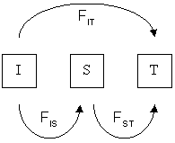

```{r setup, include = FALSE}
options(width = 160) # to prevent premature text wrapping
knitr::opts_chunk$set(cache = TRUE, cache.path = "knitr/cache/", fig.path = "knitr/figures/")
```
___
# Before we really start

___
## Why using `R` for genetics/genomics?

- you will need to learn `R` anyhow to analyse non genetic data
- you may not want to learn how to use 50 different pieces of software with various syntax
- you may want to integrate your analysis into a larger workflow (e.g. statistical analysis, plots)

___
## Outcome

- gain familiarity with `R`
- understand how microsatellite data can be handled in `R` 
- perform basic genetic analyses using the packages `adegenet`, `poppr` and `pegas`
- use _`R` Markdown_ to produce a report of the analyses, incorporating the workflow and results

___
## Homework

- analyse and interpret a Eurasian lynx dataset & produce a report (PDF) as part of course evaluation

___

## About this document

This document is an `R` Markdown document. An `R` Markdown document is the combination of a Markdown document with chunks of `R` code in the middle that are evaluated using an `R` package called `knitr`.

`R` Markdown document can be used interactively or they can be turned into beautiful HTML document or other (e.g. PDF, Word, ...) if you click on the button "Knit" on top.

The benefits of using an `R` Markdown document is that you have your text, scripts, results, plots and tables in a single place.

You can edit the current `R` Markdown file to add your own notes to it (but save it under a different name, so that you can go back to the original version if you need to) and to try out or even modify the `R` code.

If you prefer to see pure R code only, just do:

```{r purl, eval = FALSE}
#file.remove("markdown_R4G3_course.R")
knitr::purl("markdown_R4G3_course.Rmd")
```

__Note:__ it will create a file called `markdown_R4G3_course.R` but it won't overwrite it if it already exists. So, if you want some changes to be taken into account, make sure you delete the `R` file beforehand (e.g., by running the first line in the chunk above).


### Basic Markdown syntax

Just write plain text in the script. You can use different number of underscores to indicate:

- _italic_ (1 underscore on each side)
- __bold__ (2 underscores on each side)
- ___both___ (3 underscores on each side)

For example `_word_` is rendered as _word_.

### Basic `knitr` syntax

Use ` ```{r}` to start an `R` chunck and ` ``` ` to close it.

For example if you type `1 + 1` within a chunk, it will be displayed as:

```{r one plus one}
1 + 1
```

Then, to evaluate the chunck, just press CTRL-R after having put your mouse cursor inside the chunck (anywhere).

You can learn more about `R` Markdown on [this online book]( https://bookdown.org/yihui/rmarkdown/) or if you already know a little, the [R Studio cheatsheet](https://www.rstudio.com/wp-content/uploads/2016/03/rmarkdown-cheatsheet-2.0.pdf) will help you to keep it all in mind. 

___
## Getting all the `R` packages ready

We will use the `R` packages `adegenet`, `poppr` and `pegas` for the analyses and `ggplot2`, `lattice` and `viridisLite` for the plots. If you have already installed before, you can simply load the packages as follow:

```{r loading packages, message = FALSE}
library(adegenet)
library(poppr)
library(pegas)
library(ggplot2)
library(lattice)
library(viridisLite)
```

__Note 1:__ If one of the package is missing, then you must install it BEFORE loading them. So you may need to use, for ex:

```{r installing packages, eval = FALSE}
install.packages("adegenet")
```

__Note 2:__  To be able to "knit" the `R` Markdown, you will also need other `R` packages but try kniting and `R` Studio should do the rest for you.

We also add a few extra functions we coded for you:

```{r sourcing}
source("scripts/tools.R")
```

___

# Importing the data into `R`

___
## The `genepop` format

We will be using a very common type of input file for microsatellite data, which was originally developed for a stand-alone program called __Genepop__. You will learn how to create a genepop file with Jörns tomorrow. Today we will use one that we have made for you. 

Here is the basic structure:


    comment line
              locus-1, locus-2, locus-3, ... 
    pop
    Ind-1  ,   100102   135135   204208  ...
    Ind-2  ,   100100   131139   200208  ...
    Ind-3  ,   102102   131139   200204  ...
    Ind-4  ,   000000   135139   208208  ...
    ...


1. the first line is a "comment line" - you can keep notes on your project here. E.g. "24 animals, 8 loci"
2. the second line contains the names of the loci (locus-1, etc). 
3. the third line has a "pop flag" that indicates the next samples belong to the same population.
4. below this (until the next _pop flag_), every line is a multi-locus genotype per individual belonging to the population
    - the first column with sample ID (followed by a comma)
    - the following columns with the genotype at a given locus (the two alleles, without a separator)
    - missing data at a locus is denoted by "000000"
    
.

    Everyone comfortable with the terms locus, allele and genotype?


___
### Reading your data into `R`

In the folder `data` in this `R` Studio project you can find the genepop file called "nancycats.gen". 

We will create an `R` object that contains the data in nancycats.gen using the `read.genepop()` function of `adegenet`. Here we need to provide the path of the file as `"/data/nancycats.gen"` using `file =`, and some information about how microsatellite data is encoded in the file using `ncode =`. (And here we also set the argument `quiet =` but you don't have to, this is just to shorten this document by not displaying some messages.)

```{r read genepop files}
myData <- read.genepop(file = "data/nancycats.gen", ncode = 3, quiet = TRUE)
```

    Why did we use ncode = 3 ?

Now the data is read into `R`. 

If there had been a problem with the data file (e.g. incorrectly formatted), then we would have gotten an error message. Let's try:

```{r formating error while reading,error=TRUE}
badFormat <- read.genepop(file = "data/badFormatting.gen", ncode = 3, quiet = TRUE)
```

We "broke" this input file by including fewer locus names than data. The error message is telling us that the length of `dimnames [1]` (= number of locus names) does not correspond to the number of columns containing the data.

As you can see, we are lucky that `R` provides us a clue about where the problem is.

Another way we can generate an error is by providing wrong arguments to the function, despite having a properly formatted file:

```{r input error while reading, error=TRUE}
badInput <- read.genepop(file = "data/nancycats.gen", ncode = 2, quiet = TRUE)
```

Unsurprisingly, there will be an error if you type the path to the file incorrectly.

One way to limit such issues is to list all genepop files in the folder containing the data (to make sure that the file is where you are trying to read it):

```{r listing files, }
dir(path = "data/", pattern = "*.gen")
```

___

# `R` representations of your data

## The `genind` format

We haven't looked at our in data yet!

```{r first look at a genind object}
myData
```

___
__Geeky note:__ For more details on the content of the `genind` object, just try:

```{r behind the genind object 1, eval = FALSE}
str(myData)
```

or for even more geeky details:

```{r behind the genind object 2, eval = FALSE}
print.AsIs(myData)
```

As you will see, the `genind` object is a particular kind of list. Technically it is called a S4 object. Instead of elements accessible with `$`, S4 objects have slots accessible with `@` (even if the programmer behind `adegenet` made it possible to use `$` anyway).
___

Since manipulating such objects is a little complicated, you should use the _accessors_ directly available:

```{r accessors for genind objects}
nInd(myData)
nLoc(myData)
nPop(myData)
locNames(myData)
alleles(myData)
indNames(myData)
popNames(myData)
```

Some of the accessors can also be used to redefine some information (to handle with great care):

```{r accessors for replacement}
#let's give the pops some names:

myPops <- c("Pop1","Pop2","Pop3","Pop4","Pop5","Pop6","Pop7", "Pop8")
popNames(myData) <- myPops
popNames(myData)
pop(myData)
```

___

## The `loci` format

Not all `R` packages dealing with genetics/genomics use `genind` objects (it would be convenient if they did!). In particular, the package `pegas` which allows for the computation of many useful metrics relies on an alternative format called `loci`.

```{r genind to loci}
myData_loci <- genind2loci(myData) # or as.loci(myData)
myData_loci
```

The `loci` format is more simple than the `geneind` format (and so what you can do with it is more limited).

___

__Geeky note:__ A `loci` object is simply a traditional `data.frame` (an S3 object) with an additional _attribute_ called `"locicol"`:

```{r exploring loci objects}
str(myData_loci)
head(data.frame(myData_loci), n = 10) # first 10 rows
attr(myData_loci, "locicol") # columns that contain loci
```


___

# Checking your data

Let's check some basic things about the data in `myData`.

___

## Missing data

An important consideration for analysis is the amount of missing data in our dataset. Several types of analyses don't cope very well with missing data. In some cases this may lead to poor estimates, in other cases it may lead to samples or loci not being considered in the analysis.

We can use `info_table()` from `poppr` to find out about missing data, and also generate a convenient plot by including `plot = TRUE`.

```{r info table}
info_table(myData, plot = TRUE, low = "white")
```

___
__Geeky note:__ it is tricky but you can modify anything in this plot even when `info_table()` as no option for it:

<!-- no evaluation as only work in interactive mode -->
```{r ggplot, eval = FALSE}
theplot <- ggplot_build(last_plot())
theplot$data[[4]]$size <- 3
theplot$data[[4]]$angle <- 45
plot(ggplot_gtable(theplot))
```
___

We can see that there is missing data at several loci, and that this is particularly bad for our population _Pop8_.

As a general rule of thumb, we try to keep missing data below 5% in order to minimize the impact on analyses.

    How do you think we can achieve this?

Using `genotype_curve()` we can check how many loci we need in order to discriminate our genotypes. This `poppr` function  randomly samples loci without replacement and counts the number of multilocus genotypes observed. 

```{r genotype curve}
genotype_curve(myData)
```

    How many loci do we *need* in order to discriminate our genotypes?

As missing data is concentrated in a few loci and populations, rather than being thinly spread throughout the dataset, we can remove the worst offenders: a locus (fca8) and a population (Pop8).

We can 'drop' a population from the `genind` object using the following code, if we know the number (ID) of the population in the list of populations.

```{r remove pop by index, eval = FALSE, message = FALSE}
myData[pop = -c(8)]
```

However, we would like to be able to remove populations by their name. For this we need a bit more code:


```{r remove pop}
removePop <- c("Pop8")
myData <- myData[pop = !popNames(myData) %in% removePop]
```

Removing loci from a `genind` object works in a similar fashion. If you know the number (ID) of a locus, then you can use the short code `myData[loc=-c(1)]`. But again, it is better to use names.


```{r remove locus}
removeLoc <- c("fca8")
myData <- myData[loc = !locNames(myData) %in% removeLoc]
```


Now let's check `myData` and also run `info_table()` to see what's changed.

```{r new info table}
myData
info_table(myData, plot = TRUE, low = "white")
```

We have significantly reduced the amount of missing data in `myData`. 

    How else could we have solved this?
    

How about our ability to discriminate genotypes?

```{r new genotype curve}
genotype_curve(myData)
```

    Have you noticed something?
    
___
## MLG (MultiLocus Genotypes)

Depending on how we obtain our genetic samples, we may not know if we have genotyped the same individual more than once.

For example, if we have been genotyping samples collected in a non-invasive way (e.g. hair or faeces), then we don't really have a way of knowing if we have obtained more than one sample per individual.

There is an `R` package called `alleleMatch` that can investigate this in detail. However, it is no longer maintained. Thankfully, `poppr` has some basic functionality to examine this. Using `mlg()` we can check for the number of unique multilocus genotypes in `myData`.

```{r mlg}
mlg(myData)
```

We have 120 samples, but only 117 unique multilocus genotypes. This suggests that 3 samples correspond to replicates from the same individual(s). (We introduce that in the data on purpose to show you how to deal with such issues.)

__Note:__ the `mlg()` function did not tell us _which_ samples are the same. For this we can use `mlg.id()`. But this gives us a very long list, because it also includes the genotypes that occur only once. Check using `head()`:

```{r mlg.id}
head(mlg.id(myData))
```

What we want to know is _which are the genotypes that occur more than once?_

We achieve this by looking for entries in the list with a length greater than one.

```{r identifying mlg}
myMLG <- mlg.id(myData)
myMLG[lengths(myMLG) > 1]
```

As we do not want to include replicates of samples in our data, we should now remove one of each replicated genotype. We will remove N450, N463, and N468.

```{r droping mlg}
myData <- myData[!row.names(myData$tab) %in% c("N450","N463","N468")]
myData
```

Now we have 117 unique genotypes in `myData`.

    If this were data from non-invasively collected samples, we may expect there to be more duplicate genotypes that we have not detected yet. Why?

___
__Geeky note:__

If you have to remove a lot of samples, you can do it easily by replacing the previous call by:

```{r droping many loci, eval = FALSE}
samplesToRemove <- unlist(lapply(myMLG[lengths(myMLG) > 1], function(x) x[-1]))
myData <- myData[!row.names(myData$tab) %in% samplesToRemove]
```
___
## Ploidy

`info_table()` can also be used to find out about the ploidy of your data. As the results are presented for all samples, here just the first couple lines of output (achieved by using `head()`)

```{r ploidy}
head(info_table(myData, type = "ploidy"))
```

    How many alleles expect in a tetraploid?
    Could this number be 1 for a diploid?

___
## Are loci informative
Another important consideration is if our loci are variable and informative. Otherwise we're wasting time and space on keeping them! The function `informloci()` can be used to detect uninformative loci and remove them.

```{r informloci}
informloci(myData)
```

In our case, all loci are informative and they are kept. If we have uninformative loci, and want these to be removed, we need to run the following.

```{r informloci 2, eval = FALSE}
myData <- informloci(myData)
```

___

# Genetic variation
___

## A very simple exploration

You can easily explore genetic differences using our home made little function:

```{r pairwise_similarity}
lapply(seppop(myData), function(x) head(pairwise_similarity(x)))
# lapply(seppop(myData), pairwise_similarity) ## for all
```

___
## Allele vs genotype frequencies

Consider the following two populations with different genotype frequencies:

>                  AA    Aa    aa
>           Pop1   50     0    50
>           Pop2   25    50    25


    Do the genotype frequencies of the two populations differ?

    Do the allele frequencies of the two populations differ?

___

## _Do you remember ..._ {.tabset .tabset-pills}

### ?

    ... what Hardy-Weinberg equilibrium (HWE) is?

___

### Assumptions

1. Genotype frequencies are the same in males and females.

2. Genotypes mate at random _with respect to their genotype at this particular locus_ (__panmixia__).

3. Meiosis is fair.

4. There is no  new genetic material (__no mutation__).

5. There is no gene flow (__no migration__).

6. The population is of infinite size (__no drift__).

7. All matings produce the same average number of offspring (__no selection on fecundity__).

8. There are no differences among genotypes in the probability of survival (__no selection on survival__).

9. Generations do not overlap (__no selection on reproductive rate__).


___

### Freq. in next generation

Using frequency of alleles in the __current__ generation ...


$p_t = f(A)$

$q_t = f(a)$


... the frequencies in the __next generation__ can be calculated:


$f(AA) = p_t^{2}$

$f(Aa) = 2p_tq_t$

$f(aa) = q_t^{2}$

$p_{t+1} = f(AA) + \dfrac{f(Aa)}{2} = p_t^2 + \dfrac{2p_tq_t}{2} = p_t^2 + p_tq_t = p_t^2 + p_t(1-p_t) = p_t^2 + p_t - p_t^2 = p_t$

$q_{t+1} = f(aa) + \dfrac{f(Aa)}{2} = q_t^2 + \dfrac{2p_tq_t}{2} = q_t^2 + p_tq_t = q_t^2 + (1-q_t)q_t = q_t^2 + q_t - q_t^2 = q_t$

Under HWE, the allelic frequencies remain the same over time!

___

## Why do we care?

__Evolution is a change in allele frequencies in a population over time__

When a locus in a population is in HWE, it is not evolving: allele frequencies will stay the same across generations.

If HWE assumptions are not met, evolution can happen (allele frequencies may change).

Mutation, non-random mating, gene flow, genetic drift (caused by finite population size), and natural selection violate HWE assumptions and are thus "mechanisms" by which evolution may proceed.

The HWE is thus a the null model of micro-evolution.


    So is it good/bad for a locus to be in HWE?

___

## "Neutral" evolution

Very broadly speaking, there are two types of population genetics analyses you can do:

1. those that assume loci are in HWE, and

2. those that do not.

It is thus important to realise if your data reject the HWE assumptions!

___

## Testing the HWE {.tabset .tabset-pills}

With `hw.test()` from `pegas` we can test for HWE across our populations:

```{r testing HWE}
hw.test(myData, B = 0) ## for exact test instead of asymptotic, use large value of B
```

Here we have conducted a $\chi^{2}$-test based on observed and expected _genotype_ frequencies calculated from the _allele_ frequencies.

### ?

    Would we expect loci to be in HWE if we consider all populations together as we have done?

### Wahlund

The Wahlund effect refers to the reduction in the number of heterozygotes due to population structure.

Consider two populations:

>                  AA    Aa    aa
>           Pop1   50     0     0
>           Pop2    0     0    50

Here, the two populations are in HWE. 

However, if we treat them as a single population, there are no heterozygotes, and this merged-population is not in HWE. 

 
___

Let's check by population. We will split `myData` by population using the `seppop` function. This creates a list of `genind` objects, with every entry in the list consisting of a population.

To apply the HWE test with `hw.test()` to every item in the list (ie every population), we use the function `lapply()`. 

```{r HWE tested per pop}
lapply(seppop(myData), hw.test)
```

Some loci, in some populations, are still not in HWE.

    Why may this be?

___

## Linkage Disequilibrium

Another important consideration for analysing genetic data is the independence of loci. 

Imagine two loci that are physically very close on the same chromosome. Will alleles at these loci be segregating independently? 

    Do you know how this is measured?

For this reason, and many others (e.g. Fisher's runaway), it is possible that alleles at one locus may be associated with alleles at another locus. In other words, we may observe _non-random association of alleles at different loci_. This is called linkage disequilibrium.

__Why is this important?__ If two loci are not independent this will bias results.

We can look at this with the `ia()` function of `poppr`. This calculates an index of association over all loci in the `genind` object.

```{r index of association}
ia(myData, sample = 999)
```

Here we can see the distribution of expected association between alleles at different loci when there is no linkage (dark grey barplot), and the estimate for association among alleles in our total dataset (ie all loci and all pops at the same time). 

It appears we do not have a significant association across all populations; i.e., no LD.

What if we look at the same test per population? To answer this question, we use `seppop()` and `lapply()` as before. But now we include `ia()` and for the argument `sample`, which defines the number of permutations used to draw the distribution of the association index under the null hypothesis, we want a large number, e.g., 999:

```{r index of association per pop}
lapply(seppop(myData), ia, sample = 999)
```

In some populations we observe significant LD.

    Is this important?

If we want to know which two loci are in LD, we can use the `pair.ia()` function. Let's consider Pop7 using `seppop(myData)[["Pop7"]]`.

```{r pair ia}
pair.ia(seppop(myData)[["Pop7"]])
```

We can see that LD is not the same for all pairs of loci. Or can we? (Dany cannot!)

Let us change the plot so that it is easier for colour-blind people to see. For this we add some additional arguments for colour: `low="black"` and `high="green"`.


```{r plot pair ia}
lapply(seppop(myData)[7], pair.ia, low = "black", high = "green")
```

Much better ;)


___

## Descriptive statistics

There are some typical descriptive statistics you will find in most population genetics papers. These __summary statistics__ give us an overview of some important features of populations under study.

We will focus on the basic ones describing variation __within__ populations and describing variation __between__ populations.

__Note:__ many of these can be calculated _over all populations_ as well as _per population_ or between _pairs of populations_. This offers information at different scales.

___

## Heterozygosity

If we are interested in genetic variation in natural populations we often consider _heterozygosity_. 

High heterozygosity means a lot of genetic variability.

Low heterozygosity means little genetic variability.

___

Let's consider heterozygosity in a simple system with two alleles at a locus: __A__ and __a__. Let's also assume that this population is in HWE.

Then:

$p = f(A)$

$q = f(a)$

So under HWE, we obtain the following mating table:

>             A        a
>       A     p^2      pq
>       a     qp       q^2

So $pq + qp = 2pq$ gives the frequency of heterozygote genotypes.

In this two-allele system, heterozygosity is highest at $p = 0.5$. Let's visualize:

```{r heterozygotes}
freqP <- seq(from = 0, to = 1, by = 0.01)
freqQ <- 1 - freqP

plot(2*freqP*freqQ ~ freqQ, type = "l",
     ylab = "frequency of heterozygote genotypes",
     xlab = "frequency of allele 'a'")
text(0, 0, "AA")
text(1, 0, "aa")
arrows(0.45, 0, 0.05, 0)
text(0.5, 0, "Aa")
arrows(0.55, 0, 0.95, 0)
```

As you can imagine, this becomes more complex when there are more alleles per locus!

    Questions?
___

Now we will calculate the _observed heterozygosity_ in our populations, as well as the _expected heterozygosity_ if the populations are in HWE.

For this we use the `summary()` function from `adegenet`. We can extract the observed heterozygosity using `$Hobs` and the expected heterozygosity using `$Hexp`. 

To make life convenient, you can extract the values for every locus, place them in a `data.frame` and compute the difference:

```{r expected vs observed heterozygozity}
heteroz <- data.frame(Hexp = summary(myData)$Hexp, Hobs = summary(myData)$Hobs)
heteroz$diff <- heteroz$Hexp - heteroz$Hobs
heteroz
```

We can also visualize how observed heterozygosity is different from expected heterozygosity by subtracting one from the other.

If you remember from before, we saw that loci were not in HWE over all populations.

```{r plot expected minus observed heterozygozity}
barplot(heteroz$diff, main = "Heterozygosity: expected-observed",
        xlab = "locus", ylab = "Hexp - Hobs", font.lab = 2)
```

Or we can use another representation, using `ggplot2` for a change:

```{r ggplot expected minus observed heterozygozity}
heteroz$loci <- rownames(heteroz) ## ggplot needs names stored as a column

ggplot(heteroz, aes(y = Hexp, x = Hobs)) +
  geom_segment(aes(yend = Hobs, xend = Hobs), linetype = "dashed") +
  geom_label(aes(label = loci)) +
  geom_abline(slope = 1) + 
  scale_x_continuous(limits = range(c(heteroz$Hobs, heteroz$Hexp))) +
  scale_y_continuous(limits = range(c(heteroz$Hobs, heteroz$Hexp))) +
  labs(title = "Heterozygosity: expected vs observed") +
  xlab(expression(bold("Observed heterozygosity"))) +
  ylab(expression(bold("Expected heterozygosity"))) +
  theme_classic()
```

___

Now let's consider observed and expected heterozygosity by population. Here, we will focus on the mean across loci.

`adegenet` conveniently provides us with a funtion to calculate this for expected heterozygosity with `Hs()`.

```{r expected heterozygosity using Hs}
Hs(myData)   
```

To obtain observed heterozygosity there is no short cut (yet), so we need to use `lapply()` and `seppop()` again. Here we will calculate the mean of `$Hobs` per population in `myData`. As the output of `seppop` is a list, we also use `unlist()` to get a simple vector.

```{r observed heterozygosity using summary}
Hobs <- lapply(seppop(myData), function(x) mean(summary(x)$Hobs))
Hobs <- unlist(Hobs)
Hobs
```

Again, we can store the results for observed and expected heterozygosity into a `data.frame` and compute the difference:

```{r expected and observed heterozygosity per pop}
heteroz_per_pop <- data.frame(Hexp = Hs(myData), Hobs = Hobs)
heteroz_per_pop$diff <- heteroz_per_pop$Hexp - heteroz_per_pop$Hobs
heteroz_per_pop
```

We have already tested if these are significantly different above.

___
__Geeky note:__

To look at both the effect of the locus and the population at once, you can write some custom code:

```{r heteroz matrix}
heteroz_matrix <- do.call("cbind", lapply(seppop(myData),
                                          function(x) summary(x)$Hexp - summary(x)$Hobs))
heteroz_matrix
```

This can be easily plotted with `lattice`:

```{r plot heteroz matrix}
levelplot(heteroz_matrix, col.regions = viridis(100),
          main = "Heterozygosity: expected-observed",
          xlab = "Locus", ylab = "Population")
```
___

## F-statistics

An effect of population subdivision on genetic variation is the reduction in observed heterozygotes. As we have seen previously (Wahlund effect).

The extent of reduction in observed heterozygotes can be used to quantify the level of differentiation between subpopulations.

This quantification is formalised in a series of hierarchical _F-statistics_.

--> We are using a measure of departure from HWE to quantify the extent of differentiation between populations. 

___

F-statistics also provide a way to quantify the level of heterozygosity at the individual level, and if/how this departs from expectations of HWE in the population.

___

How are these linked?


 - I = individual
 - S = sub-population
 - T = total-population

We will focus on the two most common F-statistics: $F_{IS}$ and $F_{ST}$.

- $F_{IS}$ is known as the __inbreeding coefficient__.
    - this essentially measures departures from random-mating. 
    - how does heterozygosity in individuals compare to that in the subpopulation?
    - $F_{IS} = (H_S - H_I)/H_S$

- $F_{ST}$ is known as the __fixation index__.
    - measures the extent of genetic differentiation among subpopulations.
    - how is heterozygosity in the subpopulation reduced relative to the total population.
    - $F_{ST} = (H_T - H_S)/H_T$

Let's calculate $F_{ST}$ for our previous example.

>                  AA    Aa    aa
>           Pop1   50     0     0
>           Pop2    0     0    50

Here, $p = 0.5$ and $q = 0.5$.

Our expected heterozygosity for the total population (ie. Pop1 and Pop2 together) is given by 

$H_T = 2pq = 2 \times 0.5 \times 0.5 = 0.5$

As we have no variation in the subpopulations (ie. Pop1 or Pop2) $H_S = 0$ because $2pq = 2 \times 1 \times 0$

Then

$F_{ST} = (0.5 - 0) / 0.5 = 1.0$

___

__Note:__ this has been a simple exploration of how F-statistics are calculated. This has been expanded upon, and not all software or `R` packages calculate F-stats in the same way. For example, some account for factors such as how individuals disperse (island model vs stepping-stone model), the mutation process (infinite alleles model vs step-wise mutation model) and other bias adjusters (e.g. taking into account sampling bias). It is thus important to understand and report which method you use.

___

Now let's get back to `myData`.

We can use the `Fst()` function of the `pegas` package to calculate F-stats by locus, over all populations. But it requires the `loci` format, so we need to use `as.loci()` to transform our data.

```{r Fstats}
Fst(as.loci(myData))
```

    How would you interpret these values?

We can also build a `data.frame` with all the information we need:

```{r results heteroz and Fstats}
data.frame(Hobs = summary(myData)$Hobs, Hexp = summary(myData)$Hexp, Fst(as.loci(myData))[, c("Fst", "Fis")])
```

Often we are also interested in specific $F_{ST}$ values between pairs of populations. Genetic differentiation among all populations does not need to be equal.

Let's look at $F_{ST}$ between pops 1 and 2. We will extract the first two populations from `myData` and turn this into `loci` format using `as.loci()`.

```{r two pops}
myData_pop12 <- as.loci(myData[pop = c("Pop1", "Pop2")])
```

Now we estimate $F_{ST}$ over all loci, obtained by using `mean()`, and constrain ourselves to the column of the output with the $F_{ST}$ values:

```{r mean Fst two pops}
mean(Fst(myData_pop12)[, "Fst"])
```

Now we have a measure of differentiation between Pop1 and Pop2. 

This pairwise $F_{ST}$ value is the mean of $F_{ST}$ values of all loci. We can check $F_{ST}$ for every locus using `Fst(myData_pop12)[, "Fst"]`. 

As any estimate, the Fst is measured with some uncertainty. To represent this uncertainty, we can compute the 95$\%$ confidence interval of the mean Fst value using a "very simple" bootstrap (more advanced technics are possible):

```{r bootstrapping Fst}
res <- replicate(100, {
  myData_pop12 <- myData_pop12[, c(1, sample(attr(myData_pop12, "loci"), replace = TRUE))]
  mean(Fst(myData_pop12)[, "Fst"])
})
quantile(res, c(0.025, 0.975))
hist(res, xlim = c(0, 0.2)); abline(v = 0, col = 2, lwd = 2, lty = 2)
```

__Geeky note:__

For now, there is no simple solution to compute pairwise Fst in R, but here is a solution using a home made function we prepared for you:

```{r run pairwise Fst}
pairwise_F(myData, confint = FALSE) ## without Confidence Interval
pairwise_Fst <- pairwise_F(myData, confint = TRUE) ## with CI
lapply(pairwise_Fst, round, digit = 2) ## output after rounding with 2 digits
```

___

## Private alleles

It is worth checking if your populations have alleles that cannot be found in other populations. These are called "private alleles." 

We can use the `private_alleles()` function of `poppr` to get information about which alleles can only be found in a population.

Alleles are labelled as `locus.allele`.

```{r private alleles}
private_alleles(myData)
apply(private_alleles(myData), 1, sum) ## number of private alleles per pop
```

Private alleles will impact measures of differentiation between populations. Especially, if their frequency is high (i.e., if they are common).

___

# Trees & principal component analysis

Individual-based analyses frequently do not make assumptions about HWE, because they look at the differences between individuals. 

But consider how this kind of information must be presented.

`individual x individual`

It is not surprising that we have come up with ways to visualize this kind of information. 

Two very common ways are __trees__ (or networks) and __PCA__.

One benefit of displaying information in this manner is that we can see if there are groupings of individuals that are more similar to eachother than they are to other individuals.

___

## Proportion of shared alleles {.tabset .tabset-pills}

A simple measure of genetic distance is the __proportion of shared alleles__. This measure does not make assumptions about mutation, genetic drift, etc. 

It is, essentially, a measure of "how similar are two genotypes", with a value ranging from 1 (= identical) to 0 (= no shared alleles).

`adegenet` has a function to calculate this: `propShared()`.

The output of this function is a matrix with dimensions: no.of.samples x .no.of.samples. This is a bit too much to show on the screen if we consider the whole dataset of 117 samples!

Let us get the proportion of shared alleles among samples in Pop1 and display the information for the first 5 individuals:

```{r proportion of shared alleles}
similarity_mat <- propShared(myData[pop = "Pop1"])
similarity_mat[1:5, 1:5]
```

The function `nj()` of the `ape` package can create a __neighbour joining__ (NJ) tree from a __distance matrix__.

We can use the similarity matrix we just computed to obtain a distance matrix and run the neighbour joining:

```{r neighbour joining}
distance_mat <- 1 - similarity_mat
mynj <- nj(distance_mat)
mynj
```

We have reconstructed a NJ tree based on the distance matrix. But we did not plot it!

For this we need to simply use the `plot()` function, which can handle the output of `nj()` (or rather, `nj()` was coded so that we can use `plot()`). We have several options for the type of tree to be plotted using `type =`, where we will set _unrooted_.

```{r plot unrooted}
plot(mynj, type = "unrooted")
```

## Other distance measures

`adegenet` and `poppr` offer us the ability to generate other distance measures. Most of the ones offered in `poppr` work for individuals (rather than populations).

__Note:__ several of these distance measures make strong assumptions about the biological nature of our genetic samples.

Let's try another measure that makes no assumptions: _Prevosti's distance_, which we can use with `prevosti.dist()`

```{r plot prevosti small}
mynj_prevosti <- nj(prevosti.dist(seppop(myData)[["Pop1"]]))
plot(mynj_prevosti, type = "unrooted")
```

__Note:__ we did not need to use `1 - ` in this case, because the function `prevosti.dist()` directly provide a distance.

Let us compare the two trees we just made to see if they match:

```{r co-phylogenies}
cophyloplot(mynj, mynj_prevosti,
            assoc =  cbind(mynj$tip.label, mynj_prevosti$tip.label))
```

    Are you happy with that?

Now that we know how to make a NJ tree for a small dataset, we can do it for all samples in `myData`.

```{r plot prevosti big}
bignj <- nj(prevosti.dist(myData))
plot(bignj, type = "unrooted")
```

__Geeky note:__  we can improve this plot by plotting colours and changing the type of tree. Here a possibility would be a "fan" plot: 

```{r plot nj better 1, fig.height = 9, fig.width = 9}
plot(bignj, type = "fan", show.tip.label = FALSE, x.lim = c(-0.7, 0.7), no.margin = TRUE)
tiplabels(text = rownames(myData@tab),
          frame = "none",
          col = rainbow(nPop(myData))[as.numeric(myData@pop)], cex = 0.8, offset = 0.05)
legend("topleft", fill = rainbow(nPop(myData)),
       legend = popNames(myData), bty = "n",
       title = "Population")
```

Or perhaps a "radial" plot:

```{r plot nj better 2, fig.height = 9, fig.width = 9}
plot(bignj, type = "radial", show.tip.label = FALSE)
tiplabels(text = rownames(myData@tab),
          frame = "none",
          col = rainbow(nPop(myData))[as.numeric(myData@pop)], cex = 0.8, offset = 0.05)
legend("topleft", fill = rainbow(nPop(myData)),
       legend = popNames(myData), bty = "n",
       title = "Population")
```

___

## PCA (Principal Component Analysis)

An alernative to neighbour joining is to reduce the dimensionality of the problem so that it can be ploted in 2 dimensions instead of one dimension per locus. Many technics exists but the most common one is the so-called Principal Component Analysis, or PCA for short.

This is how you run a PCA:

```{r pca}
myData_matrix <- scaleGen(myData, center = FALSE, scale = FALSE, NA.method = "mean")
mypca <- dudi.pca(myData_matrix, center = TRUE, scale = TRUE, scannf = FALSE, nf = Inf)
```

### What does the PCA do?

The PCA creates new dimensions...

```{r pca explained 1}
head(mypca$li[, 1:4]) ## only show head for first 4 axes
```

which are uncorrelated...

```{r pca explained 2}
head(zapsmall(cor(mypca$li))[, 1:4])  ## only show head for first 4 axes
```

and which capture a decreasing amount of variation of the original loci:

```{r pca explained 3}
barplot(mypca$eig,
        names.arg = colnames(mypca$li),
        cex.names = 0.5,
        col = heat.colors(length(mypca$eig)),
        las = 2, ylab = "Inertia")
```

or in cumulated percentage:

```{r pca explained 4}
barplot(cumsum(100*mypca$eig/sum(mypca$eig)),
        names.arg = colnames(mypca$li),
        cex.names = 0.5,
        col = rev(heat.colors(length(mypca$eig))),
        las = 2, log = "y",
        ylab = "Cumulative proportion of variance explained")
```

### Plotting the PCA

There are many ways to plot a PCA, but here we are interested in projecting the individuals into the new loci space, so we use the function `s.class()`:

```{r plot PCA 1}
s.class(mypca$li, fac = pop(myData),
        col = rainbow(nPop(myData)), grid = FALSE, xax = 1, yax = 2, cpoint = 0)
s.label(mypca$li, add.plot = TRUE, boxes = FALSE, clabel = 0.5)
add.scatter.eig(mypca$eig[1:10], xax = 1, yax = 2, ratio = 0.15)
```

___
## DCAPC (Discriminant Analysis of Principal Components)

The PCA does not force the group to be different, it just shows the overall structure. In contrast, the DAPC is a method that allows to explore whether some combinations of alleles would allows the characterisation of distinct groups.

Here is an example:

```{r dapc}
myclusters <- find.clusters(myData, n.clust = 3, n.pca = Inf) ## better not fixing n.clust and selecting it interactivelly!!!
dapc1 <- dapc(myData, pop = myclusters$grp, n.pca = Inf, n.da = Inf)
scatter(dapc1)
```

So yes, it seems that it is possible to create groups... but it is not clear what these groups correspond to in this dataset:

```{r dapc plot comparing outcome to pop}
s.class(dapc1$ind.coord, fac = pop(myData),
        col = rainbow(nPop(myData)), grid = FALSE, xax = 1, yax = 2, cpoint = 1)
compoplot(dapc1, show.lab = TRUE, legend = FALSE, cex.names = 0.4,
          lab = paste(pop(myData), rownames(dapc1$tab)))
```

# THE END

<!-- TODO: add in sensible place the "no.alleles vs no.samples" plot -->